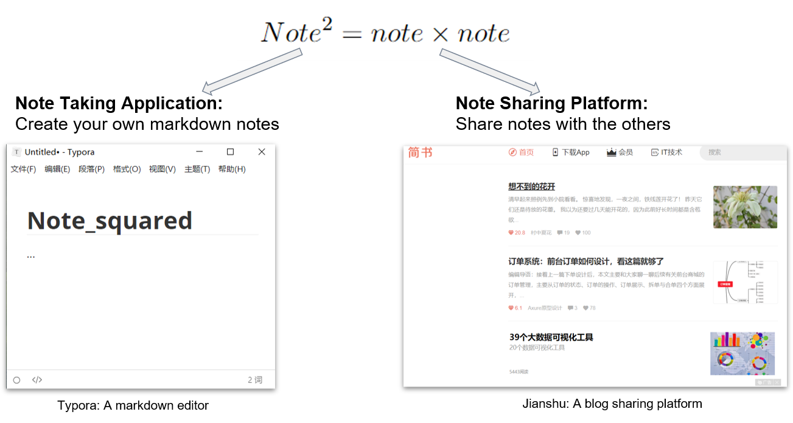
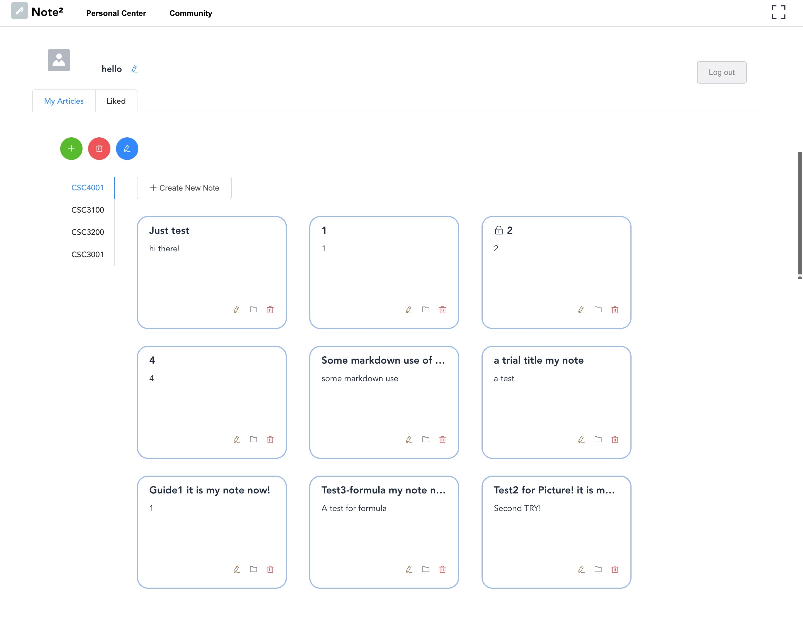
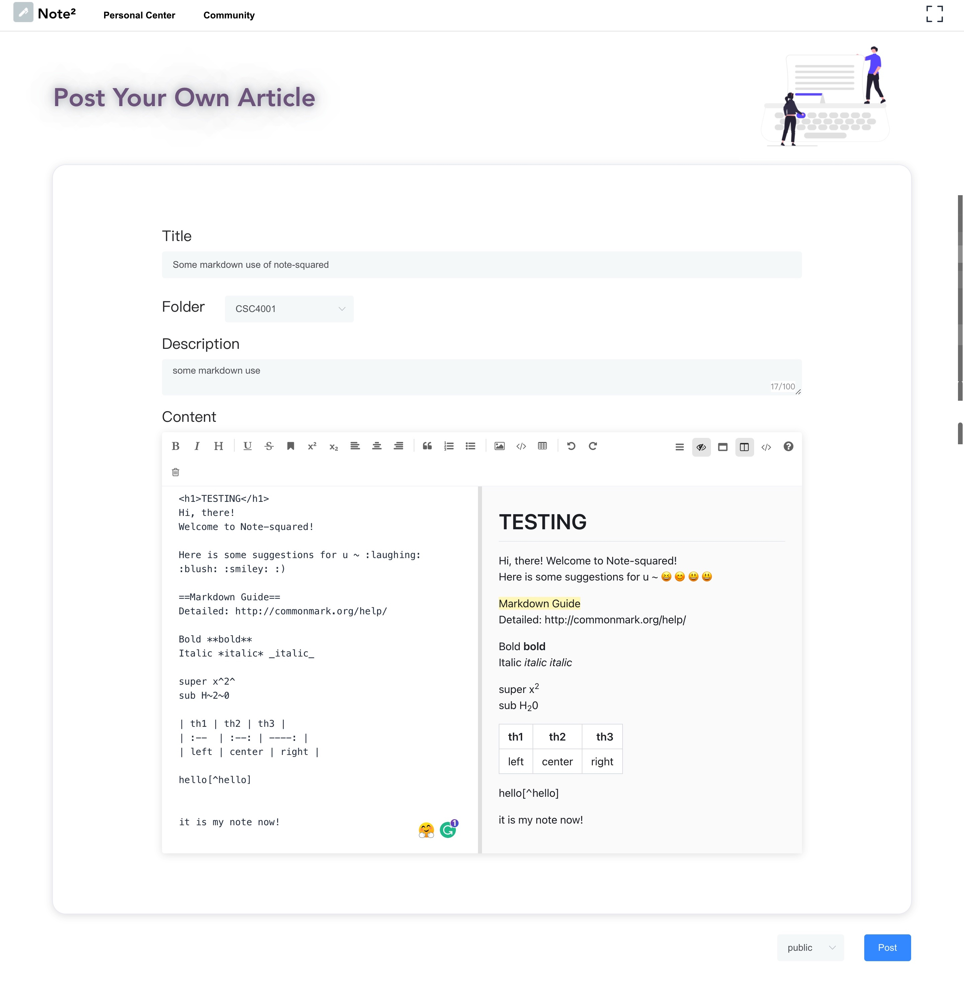
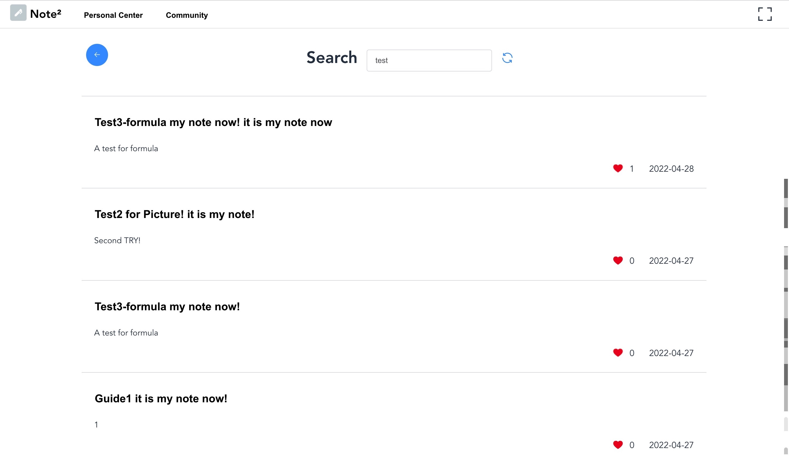
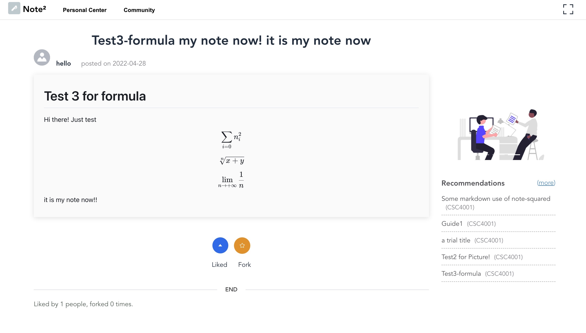
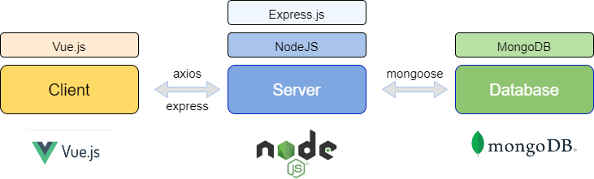

# Note$^2$: A Note-taking Application

## 1. Introduction

*Note*$^2$ (Note Squared) is a web-based note-taking application. It creates a platform for users to create, manage, and share their notes.




## 2. Features & Demo

More UI demo images and system architecture design figures (e.g. UML class diagrams, UML sequence diagrams, Data Flow Diagrams, etc.) can be found in `docs/README_img` directory.











## 3. Technology Stack

* Front-end: [Vue.js](https://vuejs.org/)
* Server-side: [Node.js - Express](http://expressjs.com/)
* Database: [MongoDB](https://www.mongodb.com/)




## 4. Run Project in Local Computer

Please refer to the following instructions to run our project in your local computer.

### 4.1 Run Front-end Locally

#### 4.1.1 Environment

* Node.js

#### 4.1.2 Launch Front-end

```bash
# open terminal in `front` directory
cd /note-squared/front

# install dependencies
npm install

# serve with hot reload at localhost:8080
npm run dev
```

```bash
# build for production with minification
npm run build

# build for production and view the bundle analyzer report
npm run build --report

# run unit tests
npm run unit

# run e2e tests
npm run e2e

# run all tests
npm test
```

For a detailed explanation on how things work, check out the [guide](http://vuejs-templates.github.io/webpack/) and [docs for vue-loader](http://vuejs.github.io/vue-loader).


### 4.2 Run Server Locally

#### 4.2.1 Environment

* **Node.js**

  Server will run in **port 3000** (i.e. `localhost:3000`)

* **MongoDB**

  For simplicity, we kept all the configurations of MongoDB as default.

  * Make sure that **MongoDB daemon** is running in **port 27017**
  * This project do not set any user & password for the database
  * A database, named `note_squared`, will be created automatically after the server launches. You may check the data in it with MongoDB Compass.

#### 4.2.2 Launch Server

```bash
# open terminal in `server` directory
cd /note-squared/server

# install dependencies
npm install

# serve with hot reload at localhost:3000
npm run dev

# OR you can run server without hot reload, using the following command
npm run start
```


## 5. Deployment Guide

You may deploy this project in a Linux server following the instructions below.

### 5.1 Front-end Deployment

#### 5.1.1 Adjust Front-end Code

* In `/front/src/axios.js`, replace `localhost:3000` with your back-end API base URL, say `note.garychen.top:3000`:

  ```javascript
  const http = axios.create({
    baseURL:'http://localhost:3000/api/user'
  })
  ```

* In `/front/src/main.js`, similarly replace the base URL:

  ```javascript
  axios.defaults.baseURL = 'http://localhost:3000/api'
  Vue.prototype.$axios = axios
  ```

* In `/front/src/utils/const.js`, similarly replace the base URL:

  ```javascript
  export const hostAddr = "http://localhost:3000";
  ```

#### 5.1.2 Deploy Front-end

You may simply follow the normal procedures of deploying Vue project.

Here is a tutorial in YouTube for your reference: [Deploy Vuejs App On Ubuntu Server](https://www.youtube.com/watch?v=rVZo2FAjXtA).

#### 5.1.3 Update Front-end Deployment

```bash
cd /var/www/html/vue/note-squared/front

git pull

npm run build
```


### 5.2 Server Deployment

#### 5.2.1 Adjust Server Code

* Change server listening port if needed.

  In `app/index.js`, update the following code:

  ```javascript
  const PORT = 3000
  ```

* Remove console log info if needed.

  In `app/index.js`, update the following code:

  ```javascript
  // print request info from front-end to console
  // (comment this out if you do not want to see the log)
  app.use(morgan('dev'))
  ```

* Update database config if needed.

  Go to `app/config/db.js`, update the config.

* Update secret key for jwt signing if needed.

  Go to `app/config/key.js`, update `secret_jwt`.

* Update email and password for sending verification code.

  Go to `app/config/nodemailer.config.js`, update the following.

  ```javascript
  // config of email sender
  const user = "note-squared@outlook.com"
  const pass = "xxxxxxxxxxxxxxx"
  ```

* **[IMPORTANT]** Make the server really send the verification code emails.

  * Go to `app/router/user/register-email-verification-code.js`, uncomment the following:

    ```javascript
    // send verification email
    // (temporarily removed)
    //await nodemailer.sendVerificationCode_register(_email, _email, _verificationCode)
    ```

  * Go to `app/router/user/set-pwd-email-verification-code.js`, uncomment the following:

    ```javascript
    // send verification email
    // (temporarily removed)
    // await nodemailer.sendVerificationCode_resetPwd(user.name, _email, _verificationCode)
    ```


#### 5.2.2 Deploy Server

```bash
apt update

#apt install nginx
#service nginx status

apt install mongodb
service mongodb status

apt install npm
npm -v
node -v
# install `n` to manage node version
npm i -g n
n 12

#exit and login to server again
node -v
npm -v

git clone ...

# install dependencies
#npm i -g yarn
#yarn
npm install

#set nginx to deliver static files...

npm i -g pm2

pm2 start ...
#pm2 start app
#pm2 restart app

pm2 status

#set nginx again...
#set server to only listen to localhost...
```

Tutorial: https://www.youtube.com/watch?v=-oTdaFDvLo4

#### 5.2.3 Update Server Deployment

```bash
cd /root/note-squared/server

git pull

pm2 restart app
```


## 6. Developers

* [Chen-Gary](https://github.com/Chen-Gary)
* [Frida161](https://github.com/Frida161)
* [Timothy-197](https://github.com/Timothy-197)
* [LYNN-CHEN](https://github.com/LYNN-CHEN)
